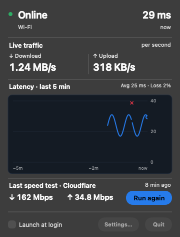

# SpeedBar

A lightweight macOS menu bar app for live network speed and connection latency.




## Features

- Live download and upload activity in the menu bar
- One-second latency samples with a rolling five-minute history
- Adaptive latency scale that keeps normal variation readable
- Visible spike and connection-failure markers
- On-demand download and upload speed test

## Download

For most users, download the latest release—no development tools are required.

1. Go to [Releases](../../releases/latest)
2. Download `SpeedBar.zip`
3. Unzip it and drag `InternetSpeed.app` into **Applications**
4. Open `InternetSpeed.app`

Because the app is not notarized, macOS may block the first launch. Right-click
the app and choose **Open**. If macOS still reports that the app is damaged, run:

```bash
xattr -dr com.apple.quarantine "/Applications/InternetSpeed.app"
```

Then open the app again.

## Updating

1. Quit the currently running copy of SpeedBar
2. Download `SpeedBar.zip` from the [latest release](../../releases/latest)
3. Unzip the download
4. Drag `InternetSpeed.app` into **Applications**
5. Choose **Replace** when Finder asks
6. Open `InternetSpeed.app` again

SpeedBar does not store account data or require a migration between versions.

## Usage

The menu bar displays current traffic, for example: `↓1.2M ↑0.3K`.

- **↓** is the current download rate
- **↑** is the current upload rate
- Left-click opens live latency history and the speed test
- Right-click quits the app

The latency chart samples once per second and shows the latest five minutes.
Its vertical scale adapts to normal conditions so small changes remain visible.
Amber markers identify spikes beyond the visible scale; red markers identify
probes that received no response.

### Launch at Login

1. Open **System Settings** → **General** → **Login Items & Extensions**
2. Click **+**
3. Select `InternetSpeed.app`

## Build from Source

### Requirements

- macOS 12.0 or later
- Xcode Command Line Tools

### Build

```bash
# Install Xcode Command Line Tools if needed
xcode-select --install

# Clone and build
git clone https://github.com/nishantkumar1292/speedbar.git
cd speedbar
./build.sh

# Run
open InternetSpeed.app
```

## Creating a Release

```bash
# Build the app
./build.sh

# Package it
ditto -c -k --norsrc --keepParent InternetSpeed.app SpeedBar.zip

# Create a release
gh release create v0.1.0 SpeedBar.zip \
  --title "SpeedBar v0.1.0" \
  --notes-file RELEASE_NOTES.md
```
